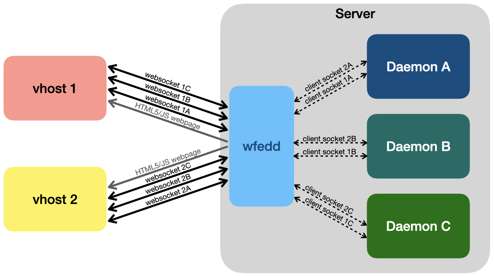

# About wfedd

`wfedd` is short for "Web Front-End for Daemons Daemon." It is a POSIX-C daemon that will bridge one or more local client sockets as websockets, served together with a static HTML5/JS website.  Thus, you can transparently access APIs to other daemons running on the server -- which themselves expose arbitrary client sockets -- via a webpage using websockets.  `wfedd` is quite a bit more resource efficient than any other method for doing this, so it is suitable for small IoT devices.

[libwebsockets](https://libwebsockets.org) (LWS) is heavily used, including its websocket and static http server implementations.  A really basic demo page is included in the source distribution.  `wfedd` adds the management and bridging fuctionality between the HTTP/WS server and local client sockets running on the server.

`wfedd` is permissively open sourced via BSD 2-clause in case you have some alternative, creative usage in mind.

### Intended Usage

`wfedd` was designed for embedded linux platforms, especially [OpenWRT](https://openwrt.org) (but not limited to this). As stated, the goal is to serve a static, HTML5/JS single-page-app (SPA) with websockets that bridge to client sockets interfacing with daemons/services running on the server.  A typical application would be a self-hosted configuration website for an IoT product.



### Why I made wfedd

If you have a POSIX machine with plenty of resources, there are other options which are more mature, such as [lighttpd](https://www.lighttpd.net) (although some additional adaptation is required).  Lighttpd, and even [duda](https://github.com/monkey/duda), were deemed to be more complex than necessary for the simple objective of serving a static, HTML5/JS single-page-app (SPA) with websockets.

##### Resource Constraints

The design target platform is an [MT7688](https://labs.mediatek.com/en/chipset/MT7688)-based module such as [AI7688H](http://www.acsip.com.tw/index.php?action=products-detail&fid1=11&fid2=&fid3=&id=29), which has 128MB of RAM to store both data and program code.  Many MT7688 modules have half this (64MB), so it is important for `wfedd` to be compact in memory usage and compact in program size.  

##### Performance Objectives

The design goal is for `wfedd` to bridge a dozen or so daemon client sockets to at least five simultaneously connected vhosts.  Preliminary testing seems to indicate throughput will not be a bottleneck for this specification.

##### Efficiency Objectives

MT7688 devices are ~580 MHz 32 bit RISC CPUs, so compute is more plentiful than memory, but nonetheless we are also interested in making `wfedd` as performant as possible.  More performant code is more efficient and leads to longer runtime on a battery charge.

### Future Improvements

`wfedd` is in alpha state right now, so the first step is just to get it stable and thoroughly tested on a number of platforms.  Beyond that, here is my backlog:

* Determine if it's possible to use libwebsockets integrated proxying features, and implement them if so.
* **Support for ubus**: `wfedd` currently works only with UNIX Domain Sockets on the daemon/client side.  OpenWRT uses ubus for a lot of IPC, so it would be good to add support for it.
* **Security**: `wfedd` serves only static content, so that takes care of a lot of this topic, but security wasn't the primary concern for the Alpha release.  `wfedd` does support TLS, but some scrutiny is probably wise in hardening the way it is deployed.


## Building wfedd

### External Dependencies

There are some external dependencies for wfedd.  All of these are relatively common to Mac and Linux distributions, and virtually all package managers have packages for all of them.  It should be noted that several of these dependencies are, in fact, child dependencies of libwebsockets, so if you have libwebsockets on your system, that's probably enough to be sure that `wfedd` will build and run.

* [libbsd](https://libbsd.freedesktop.org/wiki/) (obviously not needed if your platform is a BSD)
* [libwebsockets](https://libwebsockets.org) _child dependencies below_
  * libcrypto, libssl (from [OpenSSL](https://www.openssl.org) 1.1 or compatible)
  * [glib 2.x](https://developer.gnome.org/glib/)
  * [zlib](https://www.zlib.net)

### HBuilder Dependencies

wfedd is part of the [HB Distribution](https://github.com/jpnorair/hbdist), so the easiest way to build it is via this distribution.  

1. Install external dependencies.
2. Clone/Download hbdist repository, and `cd` into it.
3. Do the normal: `make all; sudo make install` 
4. Everything will be installed into a `/opt/` directory tree.  Make sure your `$PATH` has `/opt/bin` in it.

### Building without HB Distribution

If you want to build wfedd outside of the [HB Distribution](https://github.com/jpnorair/hbdist), you'll need to clone/download the following repositories.  You should have all these repo directories stored flat inside a root directory.

* _hbsys
* argtable
* **wfedd**

From this point:

```
$ cd wfedd
$ make pkg
```

You can find the binary inside `wfedd/bin/.../wfedd`

## Using wfedd

wfedd is a very simple program.  There is no interactivity; you just start it on the command line with command line arguments.

### Command Line Arguments

All of the command line arguments are optional, except for "socket", which is required.  The "socket" argument can be repeated as many times as you have sockets to bridge.

* **--help**: print help and exit (typical)
* **--verbose**: verbose logging information
* **--quiet**: suppress all logging information (overrides verbose)
* **--port, -P**: port of the webserver: default 7681
* **--tls, -s**: use TLS for webserver (HTTPS)
* **--socket, -S**: socket:websocket pair

### Mandatory Argument: Socket List

The only mandatory argument is the socket list argument.  It specifies the local socket (generally a UNIX socket) and the websocket path.  A socket:websocket pair is 1:1 -- in other words, you can't bridge a socket to multiple websockets, and vice versa.

This first command (below) will create a minimal webserver on port 7681, bridging the UNIX domain socket at `/opt/sockets/otdb` to `otdb` path relative to the webserver mount.

```
$ wfedd -S /opt/sockets/otdb:otdb
``` 

This second command (below) will do the same thing as the first command, except it is declaring two sockets and two websockets.

```
$ wfedd -S /opt/sockets/otdb:otdb -S /opt/sockets/otter:otter
``` 


## Version History

### 21 May 2020

First Alpha release uploaded.
